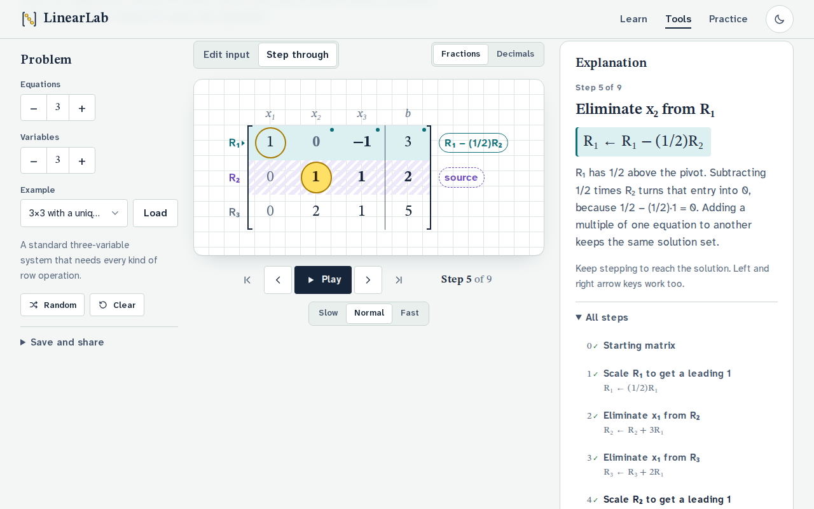
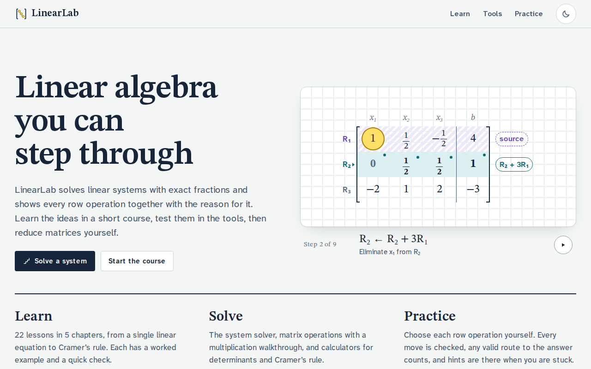
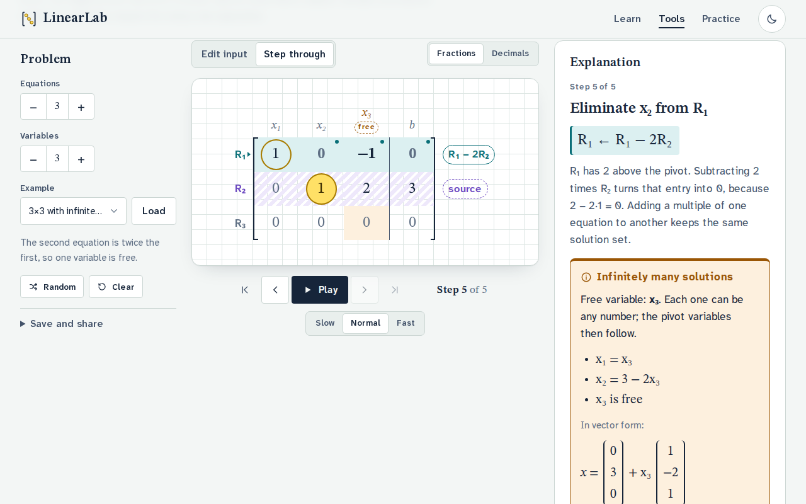
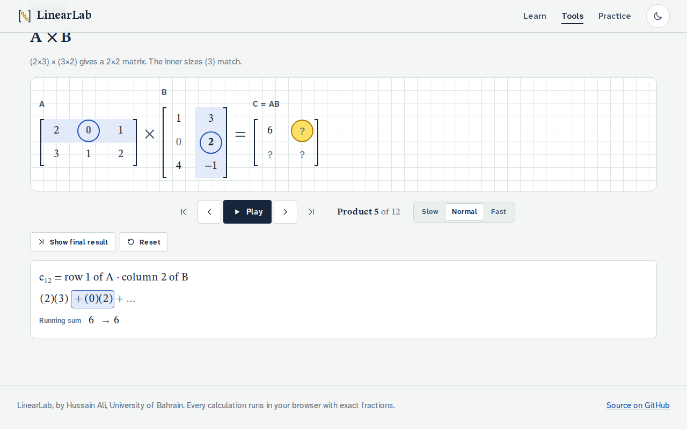
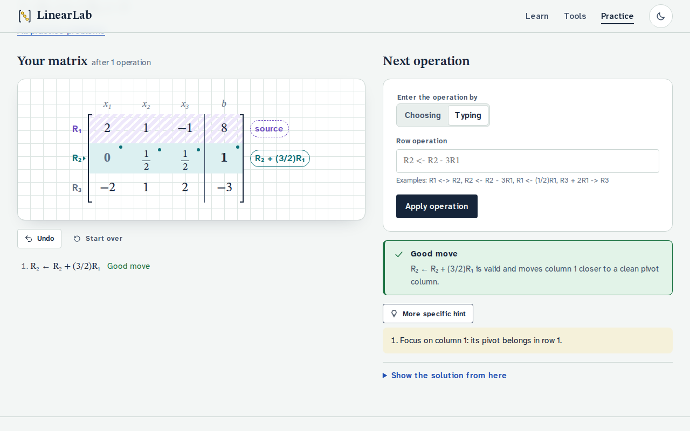
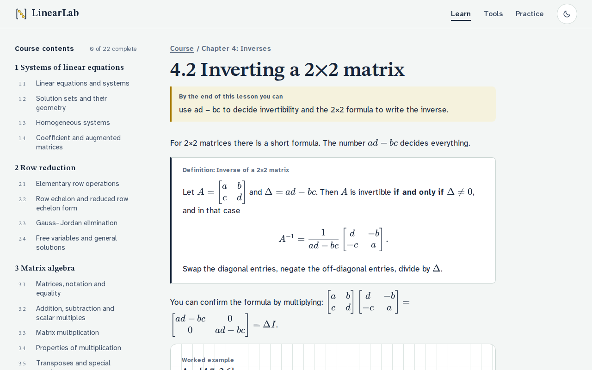
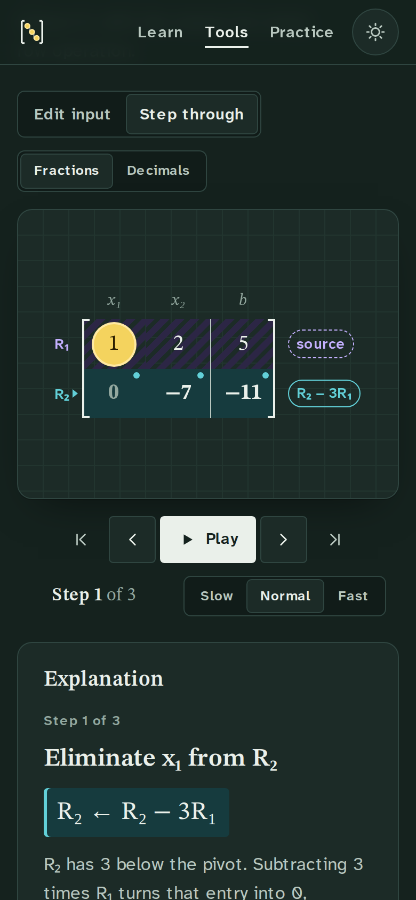

# LinearLab

An interactive linear algebra course and a set of step-by-step matrix tools. Every calculation uses exact fractions, every row operation comes with the reason for it, and every worked example in the course opens in the matching tool with one click.



## What it does

**System solver** (`/tools/rref/`)
- Edit the augmented matrix [A | b] (up to 6 equations and 6 variables). Entries can be integers, decimals, fractions such as `1/3`, or scientific notation. An invalid or empty entry is reported next to its cell, never treated as 0.
- Arrow keys and Enter move between entries. A block pasted from a spreadsheet, CSV or MATLAB (`[1 2; 3 4]`) fills the grid.
- Gauss–Jordan elimination with every swap, scaling and replacement recorded. Each step shows its notation (`R₂ ← R₂ − 3R₁`), the reason for it, and the arithmetic that creates the zero.
- Step forward and back, jump to any step in the history, play or pause, and choose a speed. ←, →, Home and End also work.
- The answer is classified as one solution, infinitely many (free variables are tagged, with the general and vector forms), or none (the contradictory row is labeled `0 = c`). It is then verified by substituting back into the original equations.
- Systems in two variables are graphed as lines: intersecting, parallel or coincident.
- Examples, random systems with whole-number answers, save/restore in the browser, shareable links, copy as text or LaTeX, and a print-friendly report of every step.
- Changing the input after solving clears the outdated steps instead of showing them for a different problem.

**Matrix operations** (`/tools/matrices/`)
- A + B, A − B, A × B, kA, transpose, determinant, inverse, rank, column space and null space. Results are explained, can be copied, and can be fed back in as A or B.
- A multiplication walkthrough that highlights the row of A, the column of B and each product, keeps a running sum, and fills C entry by entry.
- Determinants by elimination (swaps flip the sign), inverses through [A | I] → [I | A⁻¹] with the products A·A⁻¹ and A⁻¹·A actually computed, and null space vectors checked against A·v = 0.
- Identity, zero and random fills; every whole-matrix replacement can be undone.

**Determinants and Cramer's rule** (`/tools/determinant/`, `/tools/cramer/`): 2×2 and 3×3 calculators that show the hand method (ad − bc, cofactor expansion, the diagonal rule as a check). Each calculator keeps its own inputs. When det A = 0, Cramer's rule explains why it cannot be used and links the system to the solver.

**Course** (`/learn/`): 22 lessons in 5 chapters: systems of equations, row reduction, matrix algebra, inverses and determinants. Each lesson has an objective, an explanation, notation typeset with KaTeX, worked examples, a quick check, and links that load its examples into the tools. Some lessons embed interactive step-throughs, a line explorer, or calculators. Completed lessons are tracked in the browser and can be reset.

**Practice** (`/practice/`): reduce a system yourself by choosing or typing row operations (`R2 <- R2 - 3R1`, `R1 <-> R2`, `1/2 R1 -> R1`, …). Each move is checked and labeled as progress, no progress, or a setback, judged mathematically against the reduced form, so any valid order counts. Three levels of hints, undo, and the full solution from the current matrix are available. A system from the solver can be practised directly.

| | |
| --- | --- |
|  |  |
|  |  |
|  |  |

## Stack

- [Next.js 16](https://nextjs.org) (App Router, Turbopack) with React 19, exported as a static site
- TypeScript in strict mode (including `noUncheckedIndexedAccess`)
- MDX lessons through `@next/mdx`, with `remark-math` and `rehype-katex` rendering equations at build time
- CSS Modules on a small set of design tokens; fonts are STIX Two Text and Atkinson Hyperlegible Next, via `next/font`
- Vitest for the math engine and content checks, Playwright for browser tests

There is no backend: all calculation, progress and saved work stay in the browser.

## Getting started

Requires Node.js 20.9 or later.

```bash
npm install
npm run dev          # http://localhost:3000
```

| Command | What it does |
| --- | --- |
| `npm run dev` | Development server |
| `npm run typecheck` | `tsc --noEmit` |
| `npm run lint` | ESLint with the Next.js core-web-vitals and TypeScript configs |
| `npm test` | Unit tests: math engine, input parsing, practice checks, and every number stated in the lessons |
| `npm run build` | Static export to `out/` |
| `npm start` | Serve `out/` at http://localhost:4173 |
| `npm run test:e2e` | Playwright browser tests against `out/` (run `npm run build` first; `npx playwright install chromium` once) |
| `npm run check` | Typecheck, lint, unit tests and build in one go |

## Architecture

```
app/                    Routes: /, /learn, /learn/[slug], /tools/*, /practice, /practice/[id], /practice/custom
components/
  ui/                   Buttons, form controls, notices, toasts, icons
  matrix/               MatrixView (annotated display), MatrixEditor (keyboard + paste), RationalText
  steps/                usePlayback, step controls, history, explanation, EliminationPlayer
  tools/                Solver, matrix operations, determinant and Cramer calculators, WorkspaceProvider
  learning/             Course navigation, progress, quick checks, MDX building blocks and widgets
  practice/             The guided practice session
lib/
  math/                 The engine (no React, no DOM)
  storage/              Safe localStorage access, progress, saved workspaces
  url/                  Encoding problems in shareable URLs
content/lessons/        catalog.ts (the course outline) and one .mdx file per lesson
data/examples/          Example systems, matrices and practice problems
tests/unit/, tests/e2e/
```

**One math engine.** `lib/math` is plain TypeScript with no React, DOM or timers. A single elimination routine (`elimination.ts`) produces structured steps (operation, purpose, before and after snapshots, pivot, changed cells). The solver, inverse, rank and null space, determinant, practice checks and lesson demos all use it. Explanations are generated from those steps (`explain.ts`), so the text always describes the operation that was actually applied.

**One course outline.** `content/lessons/catalog.ts` lists the chapters and lessons with stable ids and slugs. Navigation, numbering, previous/next links, static route generation and progress tracking all derive from it. `bodies.ts` maps every slug to its MDX file, typed so a missing body fails to compile, and a unit test checks that there are no stray files.

**Client-side, static, shareable.** Pages are prerendered at build time; interactive tools are Client Components and lesson text stays server-rendered. Navigation between sections is client-side, and tool inputs live in a provider above the routes, so work survives moving between lessons and tools. Problems can be loaded from the URL (`/tools/rref/?A=1,2;3,-1&b=5,4`, `?example=…`). A link is applied once, so Back and Forward never overwrite later edits.

**Playback without stale timers.** Stepping is driven by one index. The only timer lives in an effect keyed on that index and the problem, so pausing, resetting, loading another problem, navigating away or unmounting cancels it.

## Mathematical accuracy

- **Exact arithmetic.** Values are `Rational`s backed by BigInt, always kept in lowest terms. `0.1 + 0.2` is exactly `3/10`, and fractions never drift.
- **No tolerance thresholds.** A determinant is zero only when it is exactly zero. The matrix `[[0.000001, 0], [0, 0.000001]]` has determinant 10⁻¹² and is inverted correctly; the previous version rejected it.
- **Display is separate from computation.** Decimal display rounds for reading only (marked ≈); results are never computed from rounded values.
- **Strict input.** Parsing never uses `eval`. Empty or malformed entries are errors, sizes are checked before every operation, and incompatible dimensions get an explanation.
- **Independent checks.** Solutions are substituted back into the original equations, inverses are multiplied out in both orders, and null space vectors are checked against A·v = 0, both in the UI and in the tests. `tests/unit/lessons.test.ts` recomputes every result quoted in the lessons.
- **Safe storage.** Saved work stores the strings you typed (never BigInt), with versioned, validated keys. Storage failures degrade quietly.

### Corrected from the previous version

The rebuild replaced the original `temp/*.html`, `js/*.js` and `style/*.css` pages. Defects found and fixed:

- The course sidebar listed 49 lessons for 41 slides; many titles opened unrelated slides and eight opened nothing. Navigation is now generated from the outline.
- The 3×3 determinant calculator read the Cramer calculator's inputs and showed 20 instead of 22 for `[[1,2,3],[0,4,5],[1,0,6]]`.
- Starting the multiplication animation replaced its own workspace with a notification and threw errors.
- Starting the RREF solver replaced the inputs, so later operations read missing elements.
- A fixed `1e-10` determinant threshold called invertible matrices singular.
- `historyList` appeared twice with the same id; determinant, inverse and rank logic existed in several copies; "Load Example" always loaded the same system.
- Wrong worked examples: `x + 2y = 5, 3x − y = 4` (correct answer 13/7, 11/7, not 1, 2); the 3×3 Cramer example (19/20, 12/5, 13/4, not 1, 3, 2); `[[2a, a+1], [4, 2]]` (det = −4 for every a, with no exceptional value); a `(3A)⁻¹` example missing a factor of 1/3; a row swap that changed a zero row; a homogeneous system said to have nontrivial solutions that it does not have. Lessons note each correction where it appears.

## Deployment

`npm run build` writes a fully static site to `out/`, which can be served by any static host. For a sub-path such as GitHub Pages (`https://<user>.github.io/LinearLab_/`), build with the base path:

```bash
NEXT_PUBLIC_BASE_PATH=/LinearLab_ npm run build
touch out/.nojekyll
```

`.github/workflows/deploy-pages.yml` does this and publishes to GitHub Pages. It runs only when started manually (Actions → Deploy to GitHub Pages → Run workflow), so merging does not change the live site by itself. `.github/workflows/ci.yml` runs typecheck, lint, unit tests, the build and the browser tests on pushes to `master` and on pull requests.

## Known limitations

- Matrices are limited to 6×6 in the tools; exact arithmetic is fast at that size, but the step-by-step displays are designed for hand-sized problems.
- The course covers systems, row reduction, matrix algebra, inverses and determinants. Topics listed in the old sidebar without content (vector spaces as a chapter, eigenvalues, orthogonality, least squares, coding theory) are not included yet.
- Progress and saved work live in this browser's storage only; there are no accounts or sync.
- The interface and course are in English.
- The build prints a harmless warning that Next.js has no fallback metrics for Atkinson Hyperlegible Next; the CSS fallback stack is used instead.

## Author

Hussain Ali, University of Bahrain.
