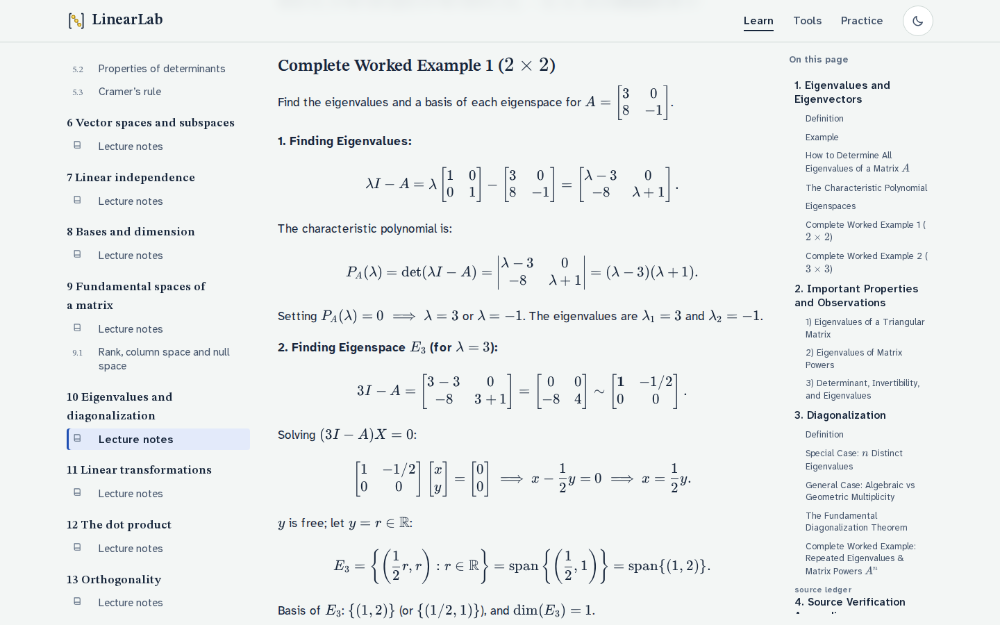
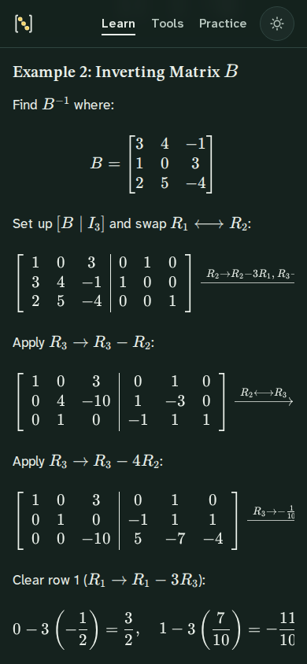

# LinearLab

An interactive linear algebra course and a set of step-by-step matrix tools. The course is thirteen chapters of lecture notes (MATHS211: systems and row reduction through eigenvalues, linear transformations and orthogonality) with short interactive lessons alongside. Every calculation uses exact fractions, every row operation comes with the reason for it, and the worked examples in the lessons open in the matching tool with one click.


## What it does

**System solver** (`/tools/rref/`)

- Edit the augmented matrix [A | b] (up to 6 equations and 6 variables). Entries can be integers, decimals, fractions such as `1/3`, or scientific notation. An invalid or empty entry is reported next to its cell, never treated as 0.
- Arrow keys and Enter move between entries. A block pasted from a spreadsheet, CSV or MATLAB (`[1 2; 3 4]`) fills the grid.
- Gauss–Jordan elimination with every swap, scaling and replacement recorded. Each step shows its notation (`R₂ ← R₂ − 3R₁`), the reason for it, and the arithmetic that creates the zero.
- Step forward and back, jump to any step in the history, play or pause, and choose a speed. ←, →, Home and End also work.
- The answer is classified as one solution, infinitely many (free variables are tagged, with the general and vector forms), or none (the contradictory row is labeled `0 = c`). It is then verified by substituting back into the original equations.
- Systems in two variables are graphed as lines: intersecting, parallel or coincident.
- Examples, random systems with whole-number answers, save/restore in the browser, shareable links, copy as text or LaTeX, and a print-friendly report of every step.
- Changing the input after solving clears the outdated steps instead of showing them for a different problem.

**Matrix operations** (`/tools/matrices/`)

- A + B, A − B, A × B, kA, transpose, determinant, inverse, rank, column space and null space. Results are explained, can be copied, and can be fed back in as A or B.
- A multiplication walkthrough that highlights the row of A, the column of B and each product, keeps a running sum, and fills C entry by entry.
- Determinants by elimination (swaps flip the sign), inverses through [A | I] → [I | A⁻¹] with the products A·A⁻¹ and A⁻¹·A actually computed, and null space vectors checked against A·v = 0.
- Identity, zero and random fills; every whole-matrix replacement can be undone.

**Determinants and Cramer's rule** (`/tools/determinant/`, `/tools/cramer/`): 2×2 and 3×3 calculators that show the hand method (ad − bc, cofactor expansion, the diagonal rule as a check). Each calculator keeps its own inputs. When det A = 0, Cramer's rule explains why it cannot be used and links the system to the solver.

**Course** (`/learn/`): thirteen chapters in academic order, each with its lecture notes, and 22 interactive lessons attached to the chapters they belong to.

- **Lecture notes** (`/learn/05-determinants/`, …) are the supplied Markdown chapters in `chapters/`, typeset in full at build time: definitions, theorems and proofs, every worked example and exercise with its calculation, tables, diagrams, and about 2,900 formulas, with matrices, systems and aligned derivations. Each chapter has an "On this page" contents list (always visible beside the text on wide screens), stable heading anchors, previous/next links, its sources and verification status, and links to the lessons, tools and practice that go with it. Wide formulas, matrices and tables scroll inside their own box on a phone instead of widening the page.
- **Source versions and ledgers.** Some chapters transcribe two or three versions of the same lecture handout, and every chapter ends with an archival ledger of the scans it was transcribed from. These are labelled in place (source version, supplementary material reconciled from the earlier lessons) and the ledger is shown collapsed. The scans themselves were not supplied, and every chapter says so.
- **Interactive lessons** (`/learn/linear-systems/`, …) are unchanged: an objective, an explanation, notation typeset with KaTeX, worked examples, a quick check, and links that load the examples into the tools; some embed step-throughs, a line explorer or calculators. Completed chapters and lessons are tracked in the browser and can be reset.
- **Search** (`/learn/search/`) covers every heading and the text under it in all thirteen chapters, and each lesson's title, objective and sections. It runs in the browser against an index built when the site is exported.

**Practice** (`/practice/`): reduce a system yourself by choosing or typing row operations (`R2 <- R2 - 3R1`, `R1 <-> R2`, `1/2 R1 -> R1`, …). Each move is checked and labeled as progress, no progress, or a setback, judged mathematically against the reduced form, so any valid order counts. Three levels of hints, undo, and the full solution from the current matrix are available. A system from the solver can be practised directly. **Concept checks** (`/practice/concepts/`) are 35 short questions on ranks, row reduction, determinants, inverses and subspaces, each with its reasoning, migrated from the original site.

|                                                                    |                                                                                                  |
| ------------------------------------------------------------------ | ------------------------------------------------------------------------------------------------ |
|                             |  |
|  |                          |
|        |                      |
|     |                          |

## Stack

- [Next.js 16](https://nextjs.org) (App Router, Turbopack) with React 19, exported as a static site
- TypeScript in strict mode (including `noUncheckedIndexedAccess`)
- MDX lessons through `@next/mdx`, with `remark-math` and `rehype-katex` rendering equations at build time
- Lecture notes as plain Markdown in `chapters/`, typeset at build time by a `unified` pipeline (`remark-parse`, `remark-gfm`, `remark-math`, `rehype-katex`) inside Server Components; nothing reads files or runs a server in production
- CSS Modules on a small set of design tokens; fonts are STIX Two Text and Atkinson Hyperlegible Next, via `next/font`
- Vitest for the math engine and content checks, Playwright for browser tests

There is no backend: all calculation, progress and saved work stay in the browser.

## Getting started

Requires Node.js 20.9 or later.

```bash
npm install
npm run dev          # http://localhost:3000
```

| Command                   | What it does                                                                                                                                                  |
| ------------------------- | ------------------------------------------------------------------------------------------------------------------------------------------------------------- |
| `npm run dev`           | Development server                                                                                                                                            |
| `npm run typegen`       | Generate Next.js route types (the global`PageProps<'/route'>` helper, `next-env.d.ts`) without building                                                   |
| `npm run typecheck`     | `typegen`, then `tsc --noEmit`. Works on a fresh checkout; plain `tsc` fails without the generated types                                                |
| `npm run lint`          | ESLint with the Next.js core-web-vitals and TypeScript configs                                                                                                |
| `npm test`              | Unit tests: math engine, input parsing, practice checks, every number stated in the lessons and the lecture notes, the course registry, search, concept checks |
| `npm run build`         | Static export to`out/`                                                                                                                                      |
| `npm run verify:export` | Checks`out/`: every lecture-notes chapter, lesson, practice and tool route exists, math is rendered and no raw LaTeX remains, every in-page link resolves, every URL is under the base path and resolves to a file (run after `build`) |
| `npm start`             | Serve`out/` at http://localhost:4173 the way a static host would                                                                                            |
| `npm run test:e2e`      | Playwright browser tests against`out/` (run `npm run build` first; `npx playwright install chromium` once)                                              |
| `npm run check`         | Typecheck, lint, unit tests, build and export verification in one go                                                                                          |

## Architecture

```
app/                    Routes: /, /learn, /learn/[slug] (lessons and lecture notes), /learn/search, /tools/*, /practice, /practice/[id], /practice/custom, /practice/concepts
chapters/               The lecture notes: one Markdown file per chapter. The only copy; the site reads them at build time
components/
  ui/                   Buttons, form controls, notices, toasts, icons
  matrix/               MatrixView (annotated display), MatrixEditor (keyboard + paste), RationalText
  steps/                usePlayback, step controls, history, explanation, EliminationPlayer
  tools/                Solver, matrix operations, determinant and Cramer calculators, WorkspaceProvider
  learning/             Course navigation, progress, search, quick checks, MDX building blocks and widgets
  learning/notes/       Rendering of the lecture notes: elements, contents list, source panel, related material
  practice/             The guided practice session and the concept checks page
lib/
  math/                 The engine (no React, no DOM)
  course/               Markdown pipeline for the notes, registry checks, search ranking and index (no React)
  storage/              Safe localStorage access, progress, saved workspaces
  url/                  Encoding problems in shareable URLs
content/lessons/        catalog.ts (THE course registry) and one .mdx file per interactive lesson
data/examples/          Example systems, matrices, practice problems and the concept checks
config/                 deployment.mjs (the base path) and math.mjs (KaTeX settings, shared by lessons and notes)
scripts/serve-static.mjs  Local static host for out/, behaving like GitHub Pages
tests/unit/             Math engine, parsing, practice, lessons, registry, notes rendering, notes numbers, search, concept checks
tests/export/           Inspects the static export in out/
tests/e2e/              Playwright browser tests (also run against a sub-path build)
docs/                   course-content.md (how the course is built and extended), content-integration-report.md, screenshots
.github/workflows/      ci.yml (checks) and deploy-pages.yml (manual publish)
web/, nots/             Legacy files from the original static site; not part of the app (see below)
```

**One math engine.** `lib/math` is plain TypeScript with no React, DOM or timers. A single elimination routine (`elimination.ts`) produces structured steps (operation, purpose, before and after snapshots, pivot, changed cells). The solver, inverse, rank and null space, determinant, practice checks and lesson demos all use it. Explanations are generated from those steps (`explain.ts`), so the text always describes the operation that was actually applied.

**One course registry.** `content/lessons/catalog.ts` lists the chapters; each has its lecture notes (a file in `chapters/`) and its interactive lessons, with stable ids and slugs, the section label the notes print for themselves, related tools and practice, and what has been verified. Navigation, numbering, the reading order and previous/next links, static route generation, search and progress tracking all derive from it, and one `[slug]` route serves lessons and lecture notes alike. `bodies.ts` maps every lesson slug to its MDX file, typed so a missing body fails to compile, and unit tests check that every file in `chapters/` and `content/lessons/` is registered and nothing else is. See [docs/course-content.md](docs/course-content.md) for how to add or update a chapter.

**Client-side, static, shareable.** Pages are prerendered at build time; interactive tools are Client Components and lesson text stays server-rendered. Navigation between sections is client-side, and tool inputs live in a provider above the routes, so work survives moving between lessons and tools. Problems can be loaded from the URL (`/tools/rref/?A=1,2;3,-1&b=5,4`, `?example=…`). A link is applied once, so Back and Forward never overwrite later edits.

**Playback without stale timers.** Stepping is driven by one index. The only timer lives in an effect keyed on that index and the problem, so pausing, resetting, loading another problem, navigating away or unmounting cancels it.

## Mathematical accuracy

- **Exact arithmetic.** Values are `Rational`s backed by BigInt, always kept in lowest terms. `0.1 + 0.2` is exactly `3/10`, and fractions never drift.
- **No tolerance thresholds.** A determinant is zero only when it is exactly zero. The matrix `[[0.000001, 0], [0, 0.000001]]` has determinant 10⁻¹² and is inverted correctly; the previous version rejected it.
- **Display is separate from computation.** Decimal display rounds for reading only (marked ≈); results are never computed from rounded values.
- **Strict input.** Parsing never uses `eval`. Empty or malformed entries are errors, sizes are checked before every operation, and incompatible dimensions get an explanation.
- **Independent checks.** Solutions are substituted back into the original equations, inverses are multiplied out in both orders, and null space vectors are checked against A·v = 0, both in the UI and in the tests. `tests/unit/lessons.test.ts` recomputes every result quoted in the lessons.
- **Safe storage.** Saved work stores the strings you typed (never BigInt), with versioned, validated keys. Storage failures degrade quietly.
- **The lecture notes are transcriptions, integrated exactly as supplied.** A formula KaTeX cannot parse fails the build, so no raw LaTeX reaches a page. The numerical results and key intermediate matrices of the worked examples and exercises in chapters 2–13 were recomputed independently with the exact engine (`tests/unit/notes-math.test.ts`). That found two printed errors, a sign in an echelon matrix in chapter 9 and a vector in chapter 10; each is shown on its chapter's page as a review note, and the text itself is not edited. Printed intermediate steps, proofs and prose were not checked, chapter 1 was not checked at all, and no transcription could be compared with its original scans, which are not in the repository. Each page says this about itself.

### Corrected from the previous version

The rebuild replaced the original `temp/*.html`, `js/*.js` and `style/*.css` pages. Defects found and fixed:

- The course sidebar listed 49 lessons for 41 slides; many titles opened unrelated slides and eight opened nothing. Navigation is now generated from the outline.
- The 3×3 determinant calculator read the Cramer calculator's inputs and showed 20 instead of 22 for `[[1,2,3],[0,4,5],[1,0,6]]`.
- Starting the multiplication animation replaced its own workspace with a notification and threw errors.
- Starting the RREF solver replaced the inputs, so later operations read missing elements.
- A fixed `1e-10` determinant threshold called invertible matrices singular.
- `historyList` appeared twice with the same id; determinant, inverse and rank logic existed in several copies; "Load Example" always loaded the same system.
- Wrong worked examples: `x + 2y = 5, 3x − y = 4` (correct answer 13/7, 11/7, not 1, 2); the 3×3 Cramer example (19/20, 12/5, 13/4, not 1, 3, 2); `[[2a, a+1], [4, 2]]` (det = −4 for every a, with no exceptional value); a `(3A)⁻¹` example missing a factor of 1/3; a row swap that changed a zero row; a homogeneous system said to have nontrivial solutions that it does not have. Lessons note each correction where it appears.

## Deployment

LinearLab is a static Next.js export (`output: 'export'`): `npm run build` writes plain HTML, CSS and JavaScript to `out/`, and any static host can serve it. There is no server, API route, middleware or runtime file access to host.

### GitHub Pages

A project site is served from a sub-path (`https://<user>.github.io/<repo>/`), so the site is built with a base path. Next.js then prefixes every link, script, stylesheet and font itself; the application code does not know about it.

```bash
LINEARLAB_BASE_PATH=/LinearLab_ npm run build
LINEARLAB_BASE_PATH=/LinearLab_ npm start      # http://localhost:4173/LinearLab_/
```

`LINEARLAB_BASE_PATH` is read in one module, `config/deployment.mjs`, which normalizes it and rejects malformed values (`/a b`, `/a/../b`, ...). The build, the local static server and the Playwright config all import it. Leave it unset for local development and for hosts that serve from the root.

**Workflows** (`.github/workflows/`):

- `ci.yml` runs on pushes to `master` and on pull requests: type check (with generated route types), lint, unit tests, build, `verify:export` and the browser tests, once for the site at `/` and once under a `/<repo>` sub-path.
- `deploy-pages.yml` is **manual** (Actions → Deploy to GitHub Pages → Run workflow) and publishes `master` only. It runs `ci.yml` as a gate, builds with the base path reported by GitHub Pages (`/<repo>` for a project site, empty for a user site or custom domain), verifies the export, and publishes `out/`. Merging does not deploy.

In the repository settings, Pages → Build and deployment → Source must be **GitHub Actions**.

### Static export notes

- Every lesson, lecture-notes and practice route is generated from the registry and the practice data with `generateStaticParams()` and `dynamicParams = false`, so there is one list of routes. Unknown URLs get `404.html`.
- The lecture notes are read from `chapters/` and typeset while `next build` prerenders the pages; the search index is built the same way. The browser only ever loads static files.
- A chapter page is 1.2 to 2.8 MB of HTML (KaTeX plus MathML for every formula) and 73 to 157 KB gzipped, which is what GitHub Pages serves. Links to lecture notes do not prefetch, so the sidebar does not pull every chapter in the background.
- Tool pages that read `?A=…&b=…` use `useSearchParams` inside `<Suspense>`; the HTML is prerendered and the problem is applied in the browser after load.
- `images.unoptimized` is set because the default image optimizer needs a server. The app has no `next/image` usage today; the diagrams in the lecture notes are SVG drawn through `` with `data:` URIs, which need no image server.
- Progress and saved work are stored in `localStorage`, so nothing needs a backend. Moving to another host later only means changing the base path variable.

## Known limitations

- Matrices are limited to 6×6 in the tools; exact arithmetic is fast at that size, but the step-by-step displays are designed for hand-sized problems.
- **Coverage.** The lecture notes cover the thirteen chapters that were supplied: systems and elimination, matrices and inverses, determinants, vector spaces, independence, bases, the fundamental spaces, eigenvalues, linear transformations, the dot product and orthogonality. Their section labels (1.1–1.4, 2.1, 4.1–4.8, 5.1–5.2, 8.1–8.2, and a second "1.2") have gaps: nothing labelled 3.x, 4.6, 6.x or 7.x was supplied. Least squares, coding theory and anything else not in those chapters is not included. No exam or revision documents were supplied, so there are none; the "(root)", "(Test1)" and "(Test2)" in the chapters' ledgers appear to name the folders the scanned handouts came from; they are not exam documents.
- **Verification.** See above: the notes are not independently verified beyond the numerical checks, and their original scans (314 files cited) are not in the repository.
- **Interactive lessons** exist for the first five chapters and the rank and null space lesson, now in chapter 9. The other chapters have lecture notes, concept checks where the questions cover the topic, and tool links, but no interactive lessons.
- **Search** needs JavaScript and covers lessons by title, objective and section headings, not their full text.
- Progress and saved work live in this browser's storage only; there are no accounts or sync.
- The interface and course are in English.
- `web/` and `nots/` are leftovers of the original static site (its vector space analyzer and practice-bank scripts, and development notes). They are not part of the Next.js app, are not built or published, and the `web/` pages are incomplete: `learn.html` and `vector_space.html` were dropped when the branches were merged, so its index links to files that no longer exist. The full original site is in the `linerarlap-learning` branch. Its scripts are linted with relaxed rules (their functions are called from inline HTML handlers). The course material in them was reviewed: the practice bank and the subspace problems were migrated as the concept checks (35 of 37 questions; two have free-text answers and were left out), the vector analyzer and its example lists were not (it is a tool, not course content), and `nots/` is development notes. See [docs/content-integration-report.md](docs/content-integration-report.md).
- The build prints a harmless warning that Next.js has no fallback metrics for Atkinson Hyperlegible Next; the CSS fallback stack is used instead.

## Author

Hussain Ali , computer since studint .
